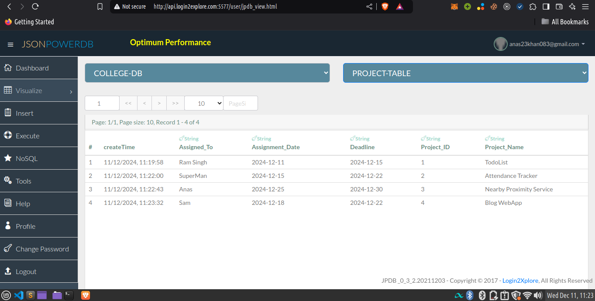

# 🚀 Project Management Form

## 📝 Description

This project implements a Project Management Form that stores data in the PROJECT-TABLE relation of a COLLEGE-DB database using JsonPowerDB. The form allows users to add, update, and manage project information efficiently.

## 🌟 Features

- Add new project entries
- Update existing project information
- Reset form for new entries
- Real-time data validation
- Utilizes JsonPowerDB for backend operations

## 🛠️ Tech Stack

- HTML5
- CSS3 (Bootstrap 3.4.1)
- JavaScript (jQuery 3.5.1)
- JsonPowerDB

## 🔑 Benefits of using JsonPowerDB

1. **High Performance**: JsonPowerDB offers lightning-fast read and write operations.
2. **Ease of Use**: Simple to use, real-time database.
3. **Schema-free**: Follows a schema-free structure for easy development.
4. **Serverless Support**: Supports serverless application development.
5. **Multi-Mode Database**: Can be used as a document DB, key-value DB, RDBMS, etc.
6. **Built-in support for querying**: Uses PowerIndex for faster data retrieval.
7. **Webservices API**: Low development cost and faster time to market.

## 📊 Project Status

This project is currently in development. Users can perform basic CRUD operations on project data.

## 🚦 Scope of Functionalities

- Create new project entries
- Retrieve project information using Project ID
- Update existing project details
- Data validation to ensure all fields are filled
- Local storage implementation for faster data retrieval

## 💡 Examples of Use

1. **Adding a New Project**:
   - Enter a unique Project ID
   - Fill in the project details
   - Click 'Save' to store the information

2. **Updating Project Information**:
   - Enter an existing Project ID
   - Modify the loaded project details
   - Click 'Update' to save changes

3. **Resetting the Form**:
   - Click 'Reset' to clear all fields and start fresh

## 📅 Release History

- 0.1.0
  - Initial release
  - Basic CRUD operations implemented
  - Form validation added

## 🔮 Future Enhancements

- Implement user authentication
- Add pagination for viewing multiple projects
- Include a dashboard for project overview
- Integrate with task management features

## 🤝 How to Contribute

1. Fork the project
2. Create your feature branch (`git checkout -b feature/AmazingFeature`)
3. Commit your changes (`git commit -m 'Add some AmazingFeature'`)
4. Push to the branch (`git push origin feature/AmazingFeature`)
5. Open a pull request

## 📜 License

This project is licensed under the MIT License - see the [LICENSE.md](LICENSE.md) file for details.

## 🙏 Acknowledgments

- [JsonPowerDB](https://login2explore.com/jpdb/) for providing the database solution
- Bootstrap for the responsive design components
